<h1 align="center">Rifky Andigta Al-Fathir</h1>

  

<b>⚙️ Systems &amp; Automation Engineer</b>

<i>I build systems that connect machines, software, and people.</i>

  
  
  
  

 

## About

I build software that connects devices, people, and production — from firmware
on the microcontroller to the desktop app on the operator's screen. My work sits
where hardware, network protocols, and user-facing tools meet, turning scattered
machines into a single, observable system.

## Focus

- **Automation** — RPA & tools that remove manual work · _Autopath_
- **Monitoring & Remote Ops** — real-time 2D/3D dashboards, SSH/VNC · _Twinscape_
- **Industrial Communication** — Modbus, MC Protocol, Open Protocol, TCP · _Protokit_
- **Embedded Systems** — ESP32/ESP8266 firmware & IoT · _Pinstream_
- **Developer Tools & Open Source** — SDKs and libraries under `@digta`
- **Security Research** — WiFi/network security tooling (lab & educational) · _BayRecon_

## Tech Stack

  
  
  
  
  
  
  
  
  

## Projects

| Project | What it does |
| --- | --- |
| **Autopath** | Visual RPA workflow designer — design the path, the bot walks it |
| **Twinscape** | Web ops console — live 2D/3D monitoring + remote SSH/VNC |
| **Protokit** | Industrial comms libraries — Modbus, MC Protocol, Open Protocol, FINS (npm) |
| **Pinstream** | ESP32 firmware — GPIO I/O streamed live over WebSocket |
| **BayRecon** | ESP8266 WiFi security toolkit — for research & lab testing |

## Open Source — Digta Labs

A growing ecosystem of composable npm packages under [`@digta`](https://www.npmjs.com/search?q=%40digta):

**Industrial protocols** — [modbus](https://www.npmjs.com/package/@digta/modbus) · [mcprotocol](https://www.npmjs.com/package/@digta/mcprotocol) · [open-protocol](https://www.npmjs.com/package/@digta/open-protocol) · [fins](https://www.npmjs.com/package/@digta/fins)

**Toolkit** — [network](https://www.npmjs.com/package/@digta/network) · [codec](https://www.npmjs.com/package/@digta/codec) · [config](https://www.npmjs.com/package/@digta/config) · [logger](https://www.npmjs.com/package/@digta/logger)

## Currently Building

- 📚 Docs & examples for the `@digta` packages
- 🌐 **Twinscape** — 2D/3D web ops console with SSH/VNC
- 🤖 **Autopath** — visual RPA workflow designer

## Contact

- ✉️ [digtaalfathir36@gmail.com](mailto:digtaalfathir36@gmail.com)
- 💼 [LinkedIn](https://www.linkedin.com/in/rifky-andigta-alfathir-5b2228159/)
- 🌐 [digtaalfathir.github.io](https://digtaalfathir.github.io/)

## Stats

  
  

## Activity

<picture>
  <source media="(prefers-color-scheme: dark)" srcset="https://threeal.github.io/threeal/grid-snake-dark.svg" />
  <source media="(prefers-color-scheme: light)" srcset="https://threeal.github.io/threeal/grid-snake-light.svg" />
  
</picture>
